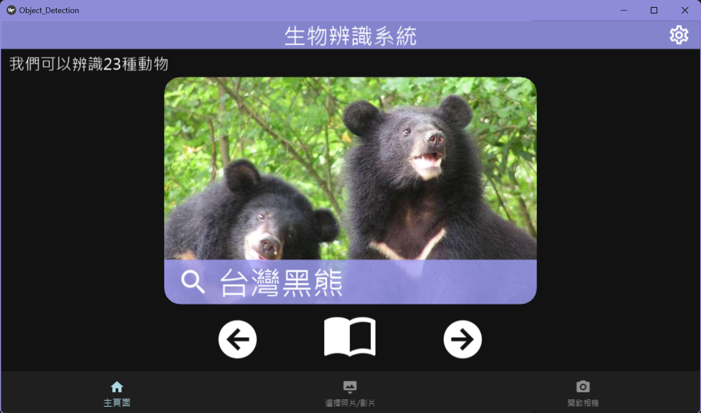
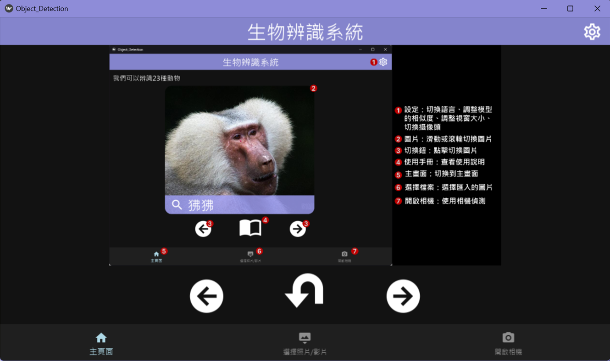
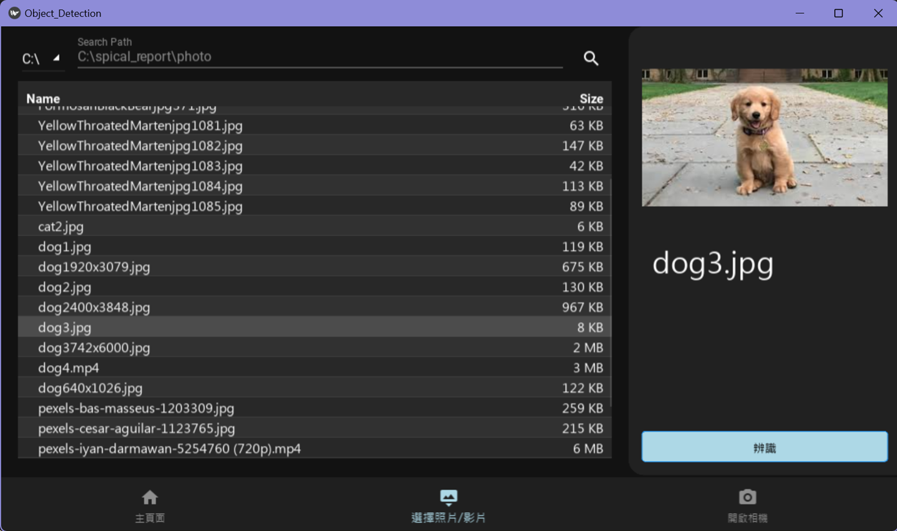
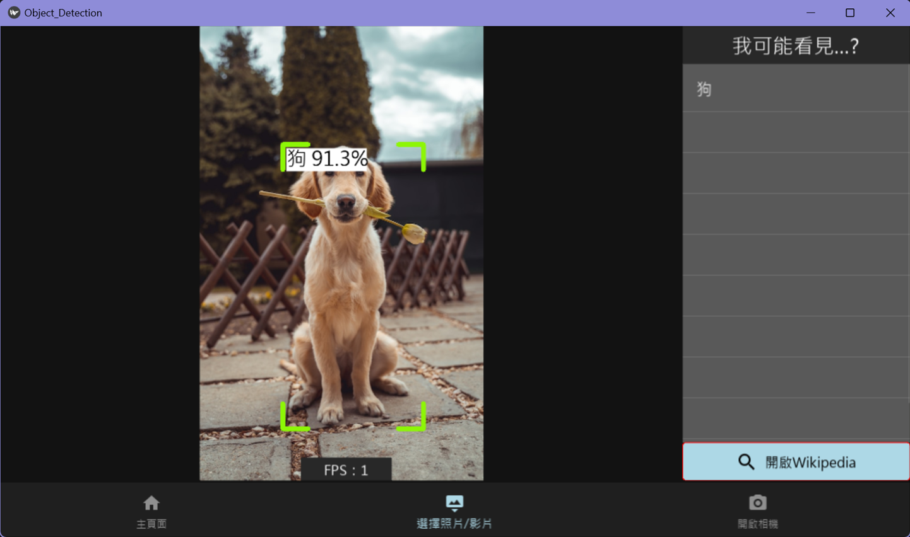
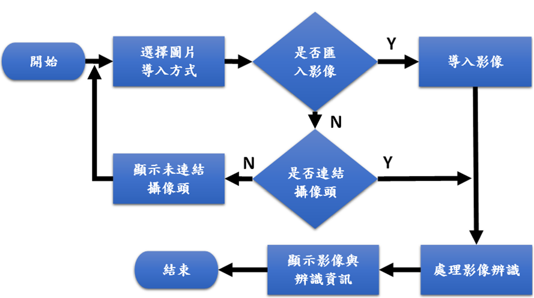

# 人工智慧生物辨識系統
---
Show video：https://youtu.be/cpq_wBQcnms

# 🧭功能：
  - 無網路也可以辨識
  - 本系統與Wikipedia`(Wiki)`連動，可查詢動物的詳細資訊
  - 可辨識[23種陸地生物](https://github.com/RayLonscholar/School_report_ODApp/blob/main/zh_labels.txt)

# 🔎預覽介面：[展示影片](https://youtu.be/cpq_wBQcnms)

    
    
    
    

# 🏗️整體架構：
<table>
  <tr>
    <th rowspan = 3>系統架構</th>
    <td>程式語言</td>
    <td>Python</td>
  </tr>
  <tr>
    <td>AI模型</td>
    <td>YOLOv8</td>
  </tr>
  <tr>
    <td>UI介面</td>
    <td>Kivy, KivyMD</td>
  </tr>
  <tr>
    <th>系統流程圖</th>
    <td colspan = 2></td>
  </tr>
</table>